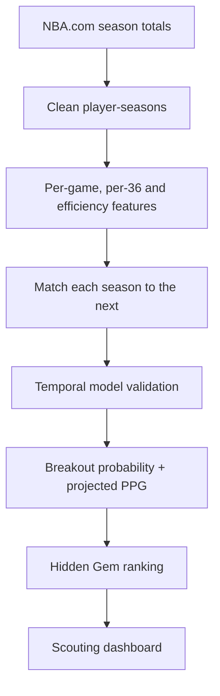

# Hidden Court 🏀

**NBA scouting analytics: finding undervalued young players before their breakout.**

Hidden Court is an end-to-end data science project that learns from historical NBA player-seasons, estimates each young player's probability of a breakout in the following season, projects next-season scoring, and turns those signals into an explainable scouting shortlist.

**Latest holdout result:** ROC-AUC `0.755`, top-decile lift `1.77×`, and next-season PPG MAE `2.73`.

> The model is a screening tool, not a replacement for film study, medical information or human scouting.

## Business question

If a basketball operations team has limited scouting time, which young rotation players deserve a closer look before their production and role increase?

The project focuses on players aged 25 or younger who played at least 20 games and between 7 and 28 minutes per game. A historical **breakout** is defined as gaining at least 4 points and 3 minutes per game in the following season.

## What the project delivers

- Historical dataset built from NBA.com regular-season totals
- Feature engineering for per-game, per-36 and shooting-efficiency metrics
- Time-based validation to prevent future information from leaking into training
- Breakout probability model and next-season points-per-game projection
- Explainable `Hidden Gem Score` for prioritizing scouting candidates
- Interactive Streamlit dashboard with filters and individual player profiles
- Automated tests for the most important transformations

## Method



### Hidden Gem Score

The final score combines:

- 55% predicted breakout probability
- 25% percentile of projected PPG growth
- 10% current efficiency signal (TS% and assist-to-turnover ratio)
- 10% opportunity signal, rewarding players producing in smaller roles

The weights are intentionally transparent and can be changed by a basketball decision-maker. The dashboard also shows the underlying components instead of presenting the score as a black box.

## Validation design

Random train/test splits would let adjacent seasons from the same era appear on both sides of the evaluation. Hidden Court instead trains on older seasons and holds out the latest fully labeled player-season cohort. After reporting holdout performance, the final model is refit on all labeled seasons and scores the latest season.

Key metrics are written to `reports/model_metrics.json`:

- **ROC-AUC** and **Average Precision** for breakout ranking quality
- **Precision, Recall and Lift in the top 10%** for the shortlist quality
- **MAE** for next-season points-per-game projection

## Run locally

```bash
python -m venv .venv
source .venv/bin/activate  # Windows: .venv\Scripts\activate
pip install -r requirements.txt
python -m scripts.download_data
python -m scripts.train_model
streamlit run app.py
```

Run tests with:

```bash
python -m pytest -q
```

## Repository structure

```text
hidden-court/
├── app.py
├── data/processed/prospects.csv
├── reports/model_metrics.json
├── scripts/
│   ├── download_data.py
│   └── train_model.py
├── src/
│   ├── data.py
│   ├── features.py
│   └── modeling.py
└── tests/test_features.py
```

Raw data, training pairs and fitted model binaries are generated locally and excluded from version control. The committed prospect table and metrics are sufficient to open the dashboard immediately.

## Responsible interpretation

“Undervalued” is a project hypothesis, not a measured financial valuation: there are no salary, contract or market-price inputs. Classifier outputs are uncalibrated ranking signals, not verified probabilities. Score weights have not been optimized or separately validated. The reported lift evaluates the classifier across the full holdout cohort, not the final composite score or only the under-26 shortlist. One holdout season does not establish consistent future performance, and no naive PPG baseline has yet been reported.

Box-score data does not capture defensive positioning, off-ball decisions, injuries, lineup context, contractual value or coaching plans. Players who leave the NBA before the following season are also absent from the paired training data, creating survivorship bias. These limitations should be considered before any personnel decision.

The MIT license covers original project code, not NBA data or third-party content. Review source terms before redistributing the included data publicly. AI-assisted development; review and understand the methodology before presenting the work in interviews.

## Data and metric references

- [NBA Stats](https://www.nba.com/stats/) — underlying regular-season player totals
- [NBA Stats Glossary](https://www.nba.com/stats/help/glossary) — official metric definitions
- [nba_api](https://github.com/swar/nba_api) — Python client used to retrieve NBA.com data

## Author

**Vinicius Neves Santana** — Data Science student interested in sports analytics and basketball operations.
